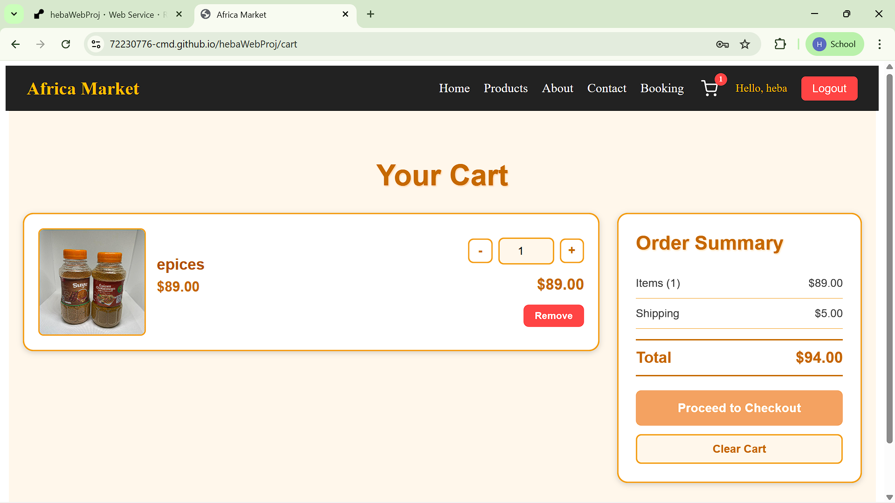
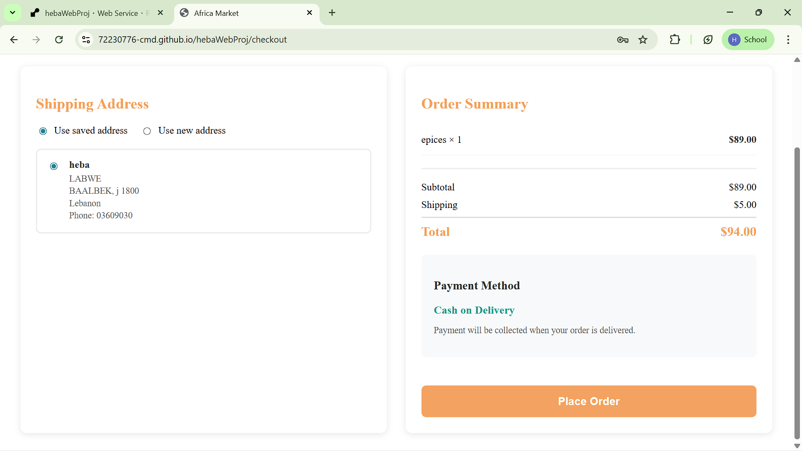
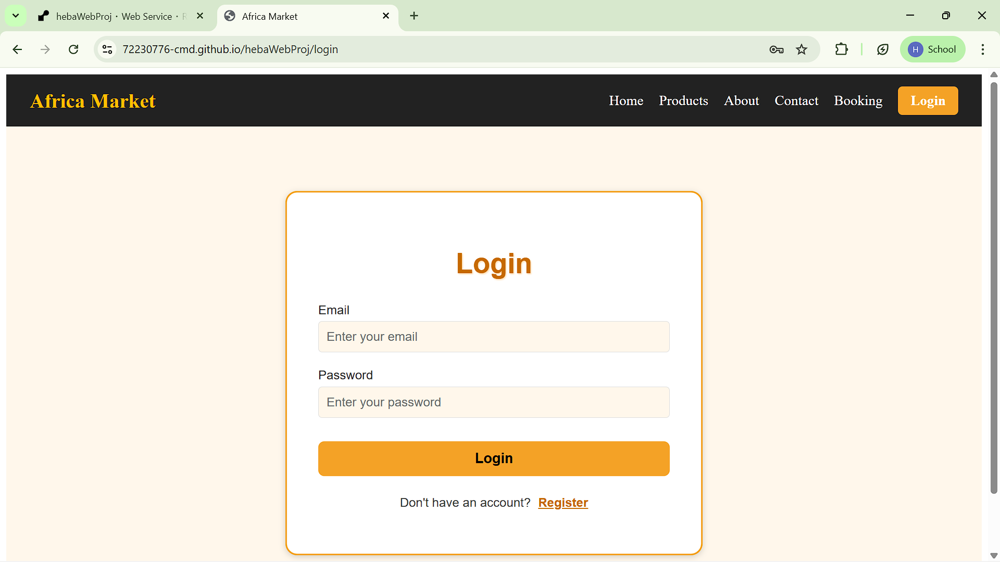
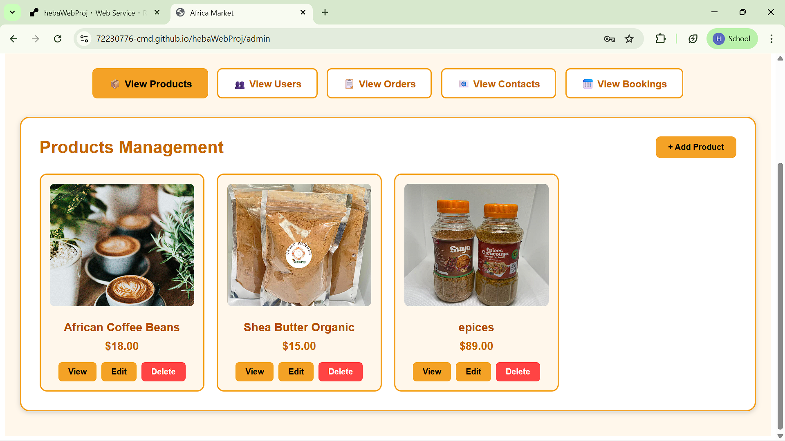
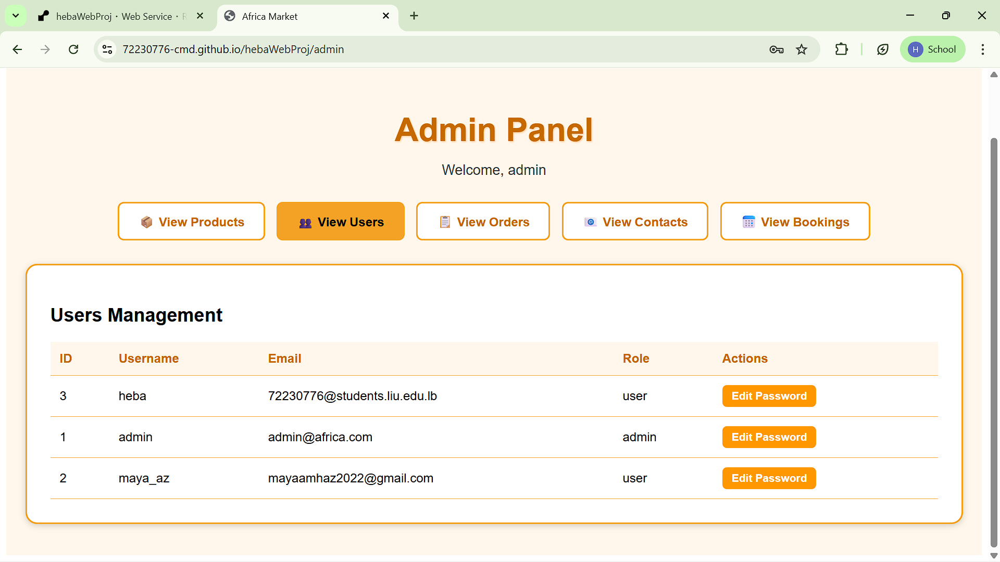
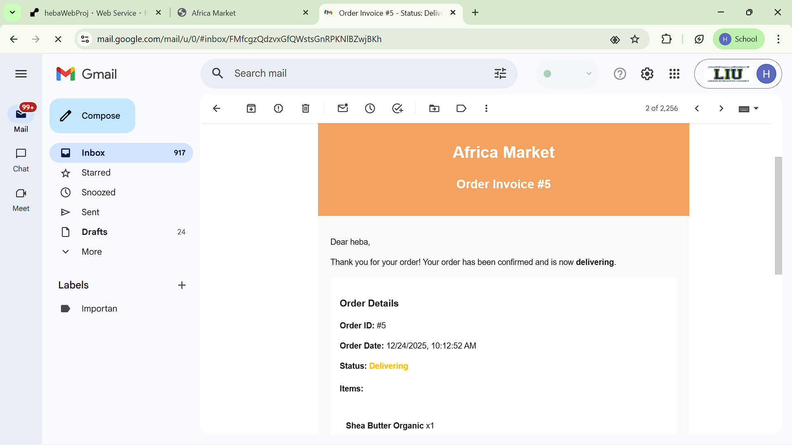
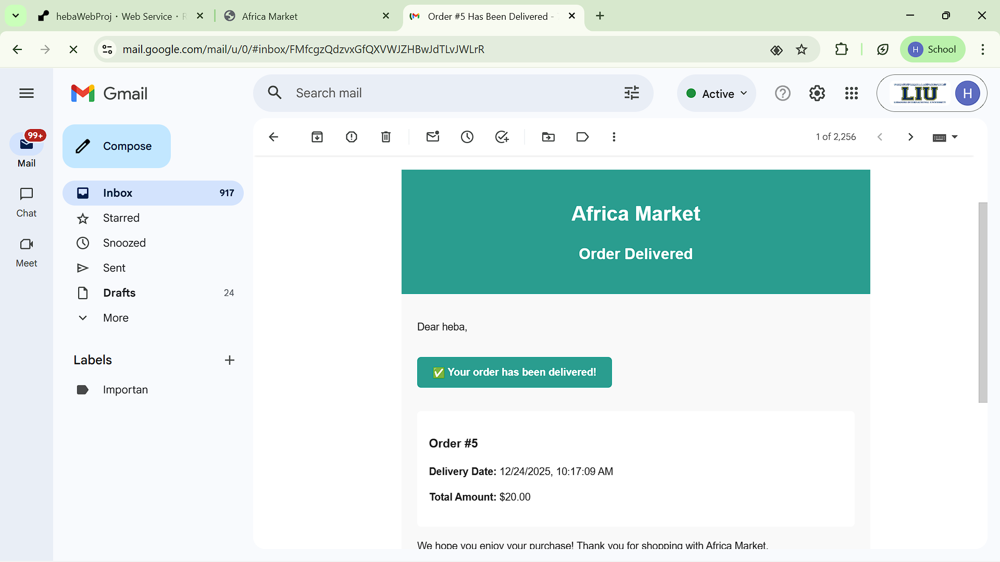

# CSCI426: Advanced Web Programming
## Project Phase 2 - Africa E-Commerce Website

**Student**: Heba (72230776@students.liu.edu.lb)  
**Course**: CSCI426 - Advanced Web Programming  
**Project**: Full-Stack E-Commerce Web Application  
**Date**: Fall 2025-2026

---

## Table of Contents

1. [Project Overview](#project-overview)
2. [Technologies Used](#technologies-used)
3. [System Architecture](#system-architecture)
4. [Features Implementation](#features-implementation)
5. [Database Design](#database-design)
6. [Code Snippets](#code-snippets)
7. [Deployment](#deployment)
8. [Screenshots](#screenshots)
9. [Conclusion](#conclusion)
10. [Future Scope](#future-scope)

---

## 1. Project Overview

### Objective
The goal of this project is to develop a fully functional e-commerce web application for an African market/store that demonstrates proficiency in:
- Web design and development principles using Node.js as a backend
- Client-server communication and database integration
- Version control and deployment using Git and GitHub

### Problem Statement
Create a complete e-commerce platform that allows users to:
- Browse and purchase products
- Manage shopping cart
- Place orders
- Contact the store
- Book appointments
- Admin management of products, orders, users, contacts, and bookings

### Solution
A full-stack web application with:
- **Frontend**: React-based responsive UI deployed on GitHub Pages
- **Backend**: Node.js/Express RESTful API deployed on Render
- **Database**: PostgreSQL (production) / MySQL (development) with proper relationships
- **Authentication**: JWT-based with role-based access control
- **Email Service**: Automated invoice and delivery notifications

---

## 2. Technologies Used

### Frontend Technologies
- **React 18.2.0** - Modern UI library for building interactive interfaces
- **React Router DOM 6.22.1** - Client-side routing
- **React Context API** - State management for authentication and cart
- **CSS3** - Styling with responsive design

### Backend Technologies
- **Node.js** - JavaScript runtime environment
- **Express.js** - Web application framework
- **JWT (JSON Web Tokens)** - Authentication and authorization
- **bcryptjs** - Password hashing
- **Resend** - Email notification service

### Database
- **PostgreSQL** - Production database (deployed on Render)
- **MySQL** - Development database support
- **mysql2** / **pg** - Database drivers

### Development Tools
- **Git** - Version control
- **GitHub** - Code repository and frontend hosting
- **Render** - Backend hosting
- **Nodemon** - Development server auto-reload

### Deployment Platforms
- **GitHub Pages** - Frontend hosting
- **Render** - Backend API hosting

---

## 3. System Architecture

### Architecture Diagram

```
┌─────────────────┐
│   React Client  │
│  (GitHub Pages) │
└────────┬────────┘
         │ HTTPS
         │ REST API
         ▼
┌─────────────────┐
│  Express Server │
│    (Render)     │
└────────┬────────┘
         │
         │ SQL Queries
         ▼
┌─────────────────┐
│   PostgreSQL    │
│   Database      │
└─────────────────┘
```

### Component Structure

**Frontend Structure:**
```
frontend/
├── src/
│   ├── components/     # Reusable components (NavBar, AdminRoute)
│   ├── pages/         # Page components (Home, Products, Cart, Admin)
│   ├── contexts/       # React contexts (AuthContext, CartContext)
│   └── styles/        # CSS stylesheets
```

**Backend Structure:**
```
backend/
├── config/           # Database configuration
├── controllers/      # Business logic
├── middleware/       # Authentication middleware
├── models/           # Database models
├── routes/           # API route definitions
└── services/         # Email service
```

---

## 4. Features Implementation

### 4.1 User Authentication ✅

**Implementation:**
- User registration with email and password validation
- Secure login with JWT token generation
- Role-based access control (Admin/User)
- Cookie-based session management
- Password hashing using bcrypt

**Key Features:**
- Email uniqueness validation
- Password strength requirements (minimum 6 characters)
- Automatic role assignment (default: 'user')
- Protected routes with middleware

### 4.2 Product Management ✅

**CRUD Operations:**
- **Create**: Admin can add new products with name, price, description, image
- **Read**: All users can view product catalog
- **Update**: Admin can modify product details
- **Delete**: Admin can remove products

**Features:**
- Product listing with images
- Price display
- Product descriptions
- Admin-only modification access

### 4.3 Shopping Cart ✅

**Features:**
- Add products to cart
- Remove items from cart
- Update quantities
- User-specific cart persistence
- Cart icon visibility (logged-in users only)
- Cart clearing on logout

### 4.4 Order Processing ✅

**Order Flow:**
1. User adds items to cart
2. Proceeds to checkout
3. Enters shipping address
4. Order is created in database
5. Invoice email sent automatically
6. Admin can update order status
7. Delivery confirmation email sent when delivered

**Features:**
- Order creation with address management
- Order status tracking (pending, processing, shipped, delivered, cancelled)
- Order history
- Email notifications

### 4.5 Admin Panel ✅

**Management Features:**
- **Products**: Full CRUD operations
- **Users**: View all users, change passwords
- **Orders**: View all orders, update status
- **Contacts**: View and delete contact submissions
- **Bookings**: View and delete appointment bookings

**Security:**
- Admin-only access with role verification
- Protected routes using middleware
- Secure password change functionality

### 4.6 Contact & Booking System ✅

**Contact Form:**
- Name, email, message submission
- Admin can view and manage submissions

**Booking System:**
- Appointment booking with date/time selection
- Order type selection
- Admin can view and manage bookings

### 4.7 Email Notifications ✅ (Bonus Feature)

**Email Types:**
1. **Invoice Email**: Sent when order is created
   - Order details
   - Item list with prices
   - Total amount
   - Shipping information

2. **Delivery Confirmation**: Sent when order status changes to "delivered"
   - Delivery confirmation message
   - Order summary

**Implementation:**
- Resend API integration
- HTML email templates
- Error handling for email failures (non-critical)

---

## 5. Database Design

### Entity Relationship Diagram

```
┌──────────┐         ┌──────────┐         ┌──────────┐
│  Users   │────────<│  Orders  │────────<│OrderItems│
└──────────┘         └──────────┘         └────┬─────┘
     │                    │                    │
     │                    │                    │
     │                    │                    ▼
     │                    │              ┌──────────┐
     │                    │              │ Products │
     │                    │              └──────────┘
     │                    │
     │                    │
     ▼                    │
┌──────────┐              │
│Addresses │              │
└──────────┘              │
                          │
                    ┌──────────┐
                    │ Contacts │
                    └──────────┘
                          │
                    ┌──────────┐
                    │ Bookings │
                    └──────────┘
```

### Database Schema

#### Users Table
```sql
CREATE TABLE users (
  id INT AUTO_INCREMENT PRIMARY KEY,
  username VARCHAR(50) UNIQUE NOT NULL,
  email VARCHAR(100) UNIQUE NOT NULL,
  password VARCHAR(255) NOT NULL,
  role ENUM('admin', 'user') DEFAULT 'user',
  is_active BOOLEAN DEFAULT TRUE,
  created_at TIMESTAMP DEFAULT CURRENT_TIMESTAMP
);
```

#### Products Table
```sql
CREATE TABLE products (
  id INT AUTO_INCREMENT PRIMARY KEY,
  name VARCHAR(255) NOT NULL,
  price DECIMAL(10, 2) NOT NULL,
  description TEXT,
  image VARCHAR(500),
  created_at TIMESTAMP DEFAULT CURRENT_TIMESTAMP
);
```

#### Orders Table
```sql
CREATE TABLE orders (
  id INT AUTO_INCREMENT PRIMARY KEY,
  user_id INT NOT NULL,
  total_amount DECIMAL(10, 2) NOT NULL,
  status ENUM('pending', 'processing', 'shipped', 'delivered', 'cancelled'),
  shipping_address TEXT,
  shipping_cost DECIMAL(10, 2) DEFAULT 5.00,
  created_at TIMESTAMP DEFAULT CURRENT_TIMESTAMP,
  FOREIGN KEY (user_id) REFERENCES users(id) ON DELETE CASCADE
);
```

#### Order Items Table
```sql
CREATE TABLE order_items (
  id INT AUTO_INCREMENT PRIMARY KEY,
  order_id INT NOT NULL,
  product_id INT NOT NULL,
  quantity INT NOT NULL DEFAULT 1,
  price DECIMAL(10, 2) NOT NULL,
  FOREIGN KEY (order_id) REFERENCES orders(id) ON DELETE CASCADE,
  FOREIGN KEY (product_id) REFERENCES products(id) ON DELETE CASCADE
);
```

### Relationships

1. **Users ↔ Orders**: One-to-Many (One user can have many orders)
2. **Orders ↔ Order Items**: One-to-Many (One order can have many items)
3. **Products ↔ Order Items**: One-to-Many (One product can be in many order items)
4. **Users ↔ Addresses**: One-to-Many (One user can have many addresses)

---

## 6. Code Snippets

### 6.1 User Authentication (Backend)

**Registration Controller:**
```javascript
// backend/controllers/authController.js
exports.register = async (req, res) => {
  try {
    const { username, email, password } = req.body;

    // Validation
    if (!username || !email || !password) {
      return res.status(400).json({
        success: false,
        message: 'Please provide username, email, and password'
      });
    }

    // Check if user exists
    const existingUser = await User.findByEmail(email);
    if (existingUser) {
      return res.status(400).json({
        success: false,
        message: 'User with this email already exists'
      });
    }

    // Create user
    const newUser = await User.create({
      username,
      email,
      password,
      role: 'user'
    });

    // Generate JWT token
    const token = generateToken(newUser.id, newUser.role);

    res.cookie('token', token, {
      httpOnly: true,
      secure: true,
      sameSite: 'none',
      maxAge: 30 * 24 * 60 * 60 * 1000
    });

    res.status(201).json({
      success: true,
      message: 'User registered successfully',
      data: { user: newUser, token }
    });
  } catch (error) {
    res.status(500).json({
      success: false,
      message: 'Error registering user'
    });
  }
};
```

### 6.2 Product CRUD Operations (Backend)

**Create Product:**
```javascript
// backend/controllers/productController.js
exports.createProduct = async (req, res) => {
  try {
    const { name, price, description, image } = req.body;

    // Validation
    if (!name || name.trim() === '') {
      return res.status(400).json({
        success: false,
        message: 'Product name is required'
      });
    }

    if (!price || isNaN(parseFloat(price)) || parseFloat(price) <= 0) {
      return res.status(400).json({
        success: false,
        message: 'Valid price is required'
      });
    }

    const product = await Product.create({
      name: name.trim(),
      price: parseFloat(price),
      description: (description || '').trim(),
      image: (image || '').trim()
    });

    res.status(201).json({
      success: true,
      message: 'Product created successfully',
      data: { product }
    });
  } catch (error) {
    res.status(500).json({
      success: false,
      message: 'Error creating product'
    });
  }
};
```

### 6.3 Authentication Middleware

```javascript
// backend/middleware/authMiddleware.js
const jwt = require('jsonwebtoken');
const User = require('../models/User');

exports.authenticate = async (req, res, next) => {
  try {
    // Get token from cookie or header
    const token = req.cookies.token || 
                  req.headers.authorization?.replace('Bearer ', '');

    if (!token) {
      return res.status(401).json({
        success: false,
        message: 'Authentication required'
      });
    }

    // Verify token
    const decoded = jwt.verify(token, process.env.JWT_SECRET);
    
    // Get user
    const user = await User.findById(decoded.userId);
    if (!user) {
      return res.status(401).json({
        success: false,
        message: 'User not found'
      });
    }

    req.user = user;
    next();
  } catch (error) {
    res.status(401).json({
      success: false,
      message: 'Invalid token'
    });
  }
};

// Admin only middleware
exports.isAdmin = (req, res, next) => {
  if (req.user && req.user.role === 'admin') {
    next();
  } else {
    res.status(403).json({
      success: false,
      message: 'Admin access required'
    });
  }
};
```

### 6.4 Order Creation with Email Notification

```javascript
// backend/controllers/checkoutController.js
exports.createOrder = async (req, res) => {
  try {
    const userId = req.user.id;
    const { items, address, shippingCost } = req.body;

    // Calculate totals
    let subtotal = 0;
    items.forEach(item => {
      subtotal += parseFloat(item.price) * item.quantity;
    });

    const finalShippingCost = parseFloat(shippingCost || 5.00);
    const totalAmount = subtotal + finalShippingCost;

    // Create order
    const order = await Order.create({
      user_id: userId,
      total_amount: subtotal,
      shipping_cost: finalShippingCost,
      shipping_address: JSON.stringify(address),
      status: 'pending'
    });

    // Create order items
    const orderItems = await Promise.all(
      items.map(item => OrderItem.create({
        order_id: order.id,
        product_id: item.productId,
        quantity: item.quantity,
        price: item.price
      }))
    );

    // Get user for email
    const user = await User.findById(userId);

    // Send invoice email
    await emailService.sendInvoiceEmail(order, user, orderItems);

    res.status(201).json({
      success: true,
      message: 'Order created successfully',
      data: { order, items: orderItems }
    });
  } catch (error) {
    res.status(500).json({
      success: false,
      message: 'Error creating order'
    });
  }
};
```

### 6.5 React Authentication Context

```javascript
// frontend/src/contexts/AuthContext.js
export const AuthProvider = ({ children }) => {
  const [user, setUser] = useState(null);
  const [loading, setLoading] = useState(true);

  const register = async (username, email, password) => {
    const response = await fetch(`${API_URL}/register`, {
      method: 'POST',
      headers: { 'Content-Type': 'application/json' },
      credentials: 'include',
      body: JSON.stringify({ username, email, password })
    });

    const data = await response.json();
    if (data.success) {
      setUser(data.data.user);
      return { success: true };
    }
    return { success: false, message: data.message };
  };

  const login = async (email, password) => {
    const response = await fetch(`${API_URL}/login`, {
      method: 'POST',
      headers: { 'Content-Type': 'application/json' },
      credentials: 'include',
      body: JSON.stringify({ email, password })
    });

    const data = await response.json();
    if (data.success) {
      setUser(data.data.user);
      return { success: true };
    }
    return { success: false, message: data.message };
  };

  return (
    <AuthContext.Provider value={{ user, register, login, logout }}>
      {children}
    </AuthContext.Provider>
  );
};
```

---

## 7. Deployment

### Frontend Deployment (GitHub Pages)

**Steps:**
1. Build React application: `npm run build`
2. Configure GitHub Pages in repository settings
3. Deploy using GitHub Actions or gh-pages package
4. Configure 404.html for client-side routing

**Live URL:** https://72230776-cmd.github.io/hebaWebProj

### Backend Deployment (Render)

**Steps:**
1. Connect GitHub repository to Render
2. Configure environment variables:
   - `DB_HOST`, `DB_USER`, `DB_PASSWORD`, `DB_NAME`
   - `JWT_SECRET`
   - `RESEND_API_KEY`
   - `EMAIL_FROM`
3. Set build command: `npm install`
4. Set start command: `npm start`
5. Configure PostgreSQL database on Render

**Live URL:** https://hebawebproj.onrender.com

### Environment Variables

**Backend .env:**
```env
# Database
DB_HOST=your-db-host
DB_USER=your-db-user
DB_PASSWORD=your-db-password
DB_NAME=your-db-name

# JWT
JWT_SECRET=your-secret-key

# Email
RESEND_API_KEY=your-resend-key
EMAIL_FROM=onboarding@resend.dev

# CORS
FRONTEND_URL=https://72230776-cmd.github.io
```

---

## 8. Screenshots

### Application Interface Screenshots

#### Screenshot 1: Homepage

*Main landing page with hero section, navigation menu, and "Welcome to Africa Market" message*

#### Screenshot 2: Products Page

*Product catalog displaying African Coffee Beans, Shea Butter Organic, and Epices with images, descriptions, and prices*

#### Screenshot 3: Shopping Cart

*Shopping cart interface showing items, quantity controls, order summary with subtotal, shipping, and total*

#### Screenshot 4: Checkout Page

*Checkout process with shipping address selection (saved address option), order summary, and payment method (Cash on Delivery)*

#### Screenshot 5: Login/Register Page

*User authentication page with email and password fields, login button, and registration link*

#### Screenshot 6: Admin Panel - Products Management

*Admin interface for managing products with view, edit, and delete options for each product*

#### Screenshot 7: Admin Panel - Orders Management

*Admin view of all orders showing order details, user information, status labels (DELIVERING, DELIVERED), and action buttons*

#### Screenshot 8: Admin Panel - Users Management

*Admin interface displaying user table with ID, username, email, role, and password change functionality*

### Email Notifications (Bonus Feature)

#### Screenshot 9: Order Invoice Email

*Automated invoice email sent via Resend API when order is created, showing order details, items, and delivery status*

#### Screenshot 10: Order Delivered Email

*Delivery confirmation email sent when order status changes to "delivered", confirming successful delivery*

---

## 9. Conclusion

### Project Achievements

This project successfully demonstrates:

1. **Full-Stack Development**: Complete implementation of both frontend and backend
2. **Database Integration**: Proper schema design with relationships and CRUD operations
3. **Authentication & Security**: JWT-based authentication with role-based access control
4. **RESTful API**: Well-structured API endpoints following REST principles
5. **Deployment**: Successful deployment on GitHub Pages and Render
6. **Version Control**: Proper Git usage with meaningful commit history
7. **Bonus Features**: Email notifications and comprehensive admin panel

### Technical Skills Demonstrated

- **Frontend**: React, React Router, Context API, Responsive CSS
- **Backend**: Node.js, Express.js, RESTful API design
- **Database**: PostgreSQL/MySQL, SQL queries, relationships
- **Security**: JWT authentication, password hashing, input validation
- **Deployment**: GitHub Pages, Render, environment configuration
- **Version Control**: Git, GitHub, commit management

### Challenges Overcome

1. **Cross-Origin Cookies**: Configured CORS and cookie settings for GitHub Pages to Render communication
2. **Database Compatibility**: Implemented dual database support (PostgreSQL/MySQL)
3. **State Management**: Used React Context API for global state
4. **Email Service**: Integrated Resend API with error handling
5. **Admin Security**: Implemented role-based access control

### Learning Outcomes

- Gained proficiency in full-stack web development
- Learned to integrate frontend and backend systems
- Understood database design and relationships
- Mastered authentication and authorization
- Experienced deployment and DevOps practices

---

## 10. Future Scope

### Planned Enhancements

1. **Payment Gateway Integration**
   - Integrate Stripe or PayPal for online payments
   - Support multiple payment methods

2. **Product Image Upload**
   - Allow admins to upload product images
   - Image storage using cloud services (AWS S3, Cloudinary)

3. **User Profile Management**
   - User dashboard for order history
   - Profile editing capabilities
   - Password change functionality for users

4. **Order Tracking**
   - Real-time order status updates
   - Tracking number generation
   - Customer-facing order tracking page

5. **Product Reviews and Ratings**
   - Customer review system
   - Rating functionality
   - Review moderation

6. **Advanced Search and Filtering**
   - Product search functionality
   - Filter by category, price range
   - Sort options

7. **Wishlist Functionality**
   - Save favorite products
   - Share wishlists
   - Price drop notifications

8. **Mobile Application**
   - React Native mobile app
   - Push notifications
   - Mobile-optimized experience

9. **Analytics Dashboard**
   - Sales analytics
   - User behavior tracking
   - Product performance metrics

10. **Multi-language Support**
    - Internationalization (i18n)
    - Multiple language options
    - Currency conversion

---

## Appendix

### A. API Endpoints Summary

**Authentication:**
- `POST /api/auth/register` - Register user
- `POST /api/auth/login` - Login user
- `GET /api/auth/profile` - Get user profile

**Products:**
- `GET /api/products` - Get all products
- `GET /api/products/:id` - Get product by ID
- `POST /api/admin/products` - Create product (admin)
- `PUT /api/admin/products/:id` - Update product (admin)
- `DELETE /api/admin/products/:id` - Delete product (admin)

**Orders:**
- `POST /api/checkout` - Create order
- `GET /api/admin/orders` - Get all orders (admin)
- `PUT /api/admin/orders/:id/status` - Update order status (admin)

**Admin:**
- `GET /api/admin/users` - Get all users (admin)
- `PUT /api/admin/users/:id/password` - Change password (admin)
- `GET /api/admin/contacts` - Get contacts (admin)
- `DELETE /api/admin/contacts/:id` - Delete contact (admin)
- `GET /api/admin/bookings` - Get bookings (admin)
- `DELETE /api/admin/bookings/:id` - Delete booking (admin)

**Public:**
- `POST /api/contact` - Submit contact form
- `POST /api/booking` - Book appointment

### B. Git Repository

**Repository URL:** [Your GitHub Repository URL]

**Commit History:** Available on GitHub with meaningful commit messages demonstrating:
- Feature implementations
- Bug fixes
- Code refactoring
- Documentation updates

### C. Project Files Structure

```
africa_full_website/
├── frontend/
│   ├── src/
│   │   ├── components/
│   │   ├── pages/
│   │   ├── contexts/
│   │   └── styles/
│   └── package.json
├── backend/
│   ├── config/
│   ├── controllers/
│   ├── middleware/
│   ├── models/
│   ├── routes/
│   ├── services/
│   └── server.js
├── screenshots/
├── README.md
└── PROJECT_PRESENTATION.md
```

---

## References

- React Documentation: https://react.dev
- Express.js Documentation: https://expressjs.com
- PostgreSQL Documentation: https://www.postgresql.org/docs
- JWT Documentation: https://jwt.io
- GitHub Pages: https://pages.github.com
- Render Documentation: https://render.com/docs

---

**End of Presentation**

---

*This document can be converted to PDF using tools like:*
- *Markdown to PDF converters (Pandoc, Markdown PDF)*
- *Online converters (Markdown to PDF)*
- *Export from Markdown editors (Typora, Mark Text)*

